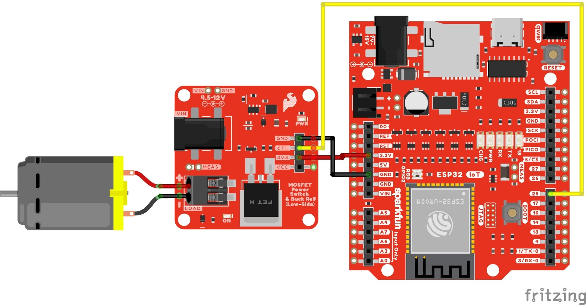
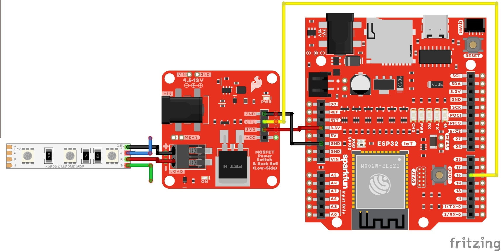

!!! arduino
    This example assumes you are using the latest version of the Arduino IDE on your desktop. If this is your first time using the Arduino IDE or board add-on, please review the following tutorials.

    - [Installing the Arduino IDE](https://learn.sparkfun.com/tutorials/installing-arduino-ide)
    - [Installing Board Definitions in the Arduino IDE](https://learn.sparkfun.com/tutorials/installing-board-definitions-in-the-arduino-ide)

    If you've never connected an CH340 device to your computer before, you may need to install drivers for the USB-to-serial converter. Check out our section on "[How to Install CH340 Drivers](https://learn.sparkfun.com/tutorials/sparkfun-serial-basic-ch340c-hookup-guide#drivers-if-you-need-them)" for help with the installation.

You will need either a microcontroller's digital or PWM pin to control the N-channel MOSFET Power Switch. Let's check out a few of the examples below to get started!


### Example 1: Switching a Load

In this example, we will turn on and off a load using the N-channel MOSFET every few seconds. The load can be a solenoid, DC motor, or a 12V LED.

#### Parts Needed

Grab the following quantities of each part listed to build this circuit:

* 1x [SparkFun IoT RedBoard - ESP32 Development Board](https://www.sparkfun.com/products/19177)
* 1x [USB-C Cable](https://www.sparkfun.com/products/15092)
* 3x [SparkFun MOSFET Power Switch and Buck Regulator (Low-Side)](https://www.sparkfun.com/products/23979)
* 1x [SparkFun Mini Screwdriver](https://www.sparkfun.com/products/9146)
* 3x [M/M Jumper Wires](https://www.sparkfun.com/products/8431)
* 1x [Squirrel Cage Blower (12V)](https://www.sparkfun.com/products/11270)
* 1x Ping Pong Ball
* 1x [12V Wall Adapter Power Supply](https://www.sparkfun.com/products/15313)


#### Hardware Hookup

You will need to connect everything as explained earlier. For this particular example, we will use a squirrel cage blower with a motor as shown in the circuit diagram below. Of course, we are using a generic motor in the circuit diagram to represent the squirrel cage blower.

<div style="text-align: center;">
  <table>
    <tr style="vertical-align:middle;">
     <td style="text-align: center; vertical-align: middle;"><a href="../assets/img/SparkFun_Power_Control_Switch_N-Channel_MOSFET_Buck_Regulator_RedBoard_Arduino_IoT_ESP32_Motor_bb.jpg."></a></td>
    </tr>
  </table>
</div>

Your setup should look similar to the image below without the power supply.

<div style="text-align: center;">
  <table>
    <tr style="vertical-align:middle;">
     <td style="text-align: center; vertical-align: middle;"><a href="../assets/img/23979-MOSFET_Power_Switch_ESP32_Arduino_Squirrel_Cage_Blower_Motor.jpg"></a></td>
    </tr>
  </table>
</div>


#### Upload Code

To upload code, insert the USB cable into the IoT RedBoard - ESP32.

!!! note
    This example is similar to the built-in Arduino example. From the menu, select the following: **File** > **Examples** > **01.Basics** > **Blink**. You will need to modify the macro (`LED_BUILTIN`) with a digital pin for your microcontroller. Note that the logic is reversed due to the transistor.

Copy the following code and paste it in the Arduino IDE. If you have not already, select your Board (in this case, the **SparkFun ESP32 IoT RedBoard**), and associated COM port. Then hit the upload button.

``` c
/******************************************************************************
  Example 1: Switching a Load
  Modified By: Ho Yun "Bobby" Chan
  SparkFun Electronics
  Date: October 27th, 2023
  License: MIT. See license file for more information but you can
  basically do whatever you want with this code.

  This example is based on Arduino's blink example. It has been modified
  so that it can be used for the SparkFun IoT RedBoard - ESP32 but it can be
  used with any Arduino that has a digital pin. The load (solenoid, DC motor,
  or 12V LED) will toggle on and off every 5 seconds.

  Users can also open the Serial Monitor at 115200 to check on
  the status of the load for debugging.

  Feel like supporting open source hardware?
  Buy a board or component from SparkFun!

      SparkFun IoT RedBoard - ESP32 Development Board:            https://www.sparkfun.com/products/19177
      SparkFun MOSFET Power Switch and Buck Regulator (Low-Side): https://www.sparkfun.com/products/23979
      Solenoid - 12V (Latch / Lock):                              https://www.sparkfun.com/products/15324
      Hobby Motor - Gear:                                         https://www.sparkfun.com/products/11696
      Blower - Squirrel Cage (12V):                               https://www.sparkfun.com/products/11270
      12V LED RGB Strip - Bare (1m):                              https://www.sparkfun.com/products/12021
      Wall Adapter 12V/600mA, (Barrel Jack):                      https://www.sparkfun.com/products/15313

  Distributed as-is; no warranty is given.
******************************************************************************/

//define a pin for the load, you'll need to adjust this
//depending on the microcontroller that you using
const int loadPin = 25;

// the setup function runs once when you press reset or power the board
void setup() {

  //Initialize Serial for Debugging if there is no built-in LED
  Serial.begin(115200);
  Serial.println("Toggling a Load!");

  // initialize digital pin as an output.
  pinMode(loadPin, OUTPUT);
  digitalWrite(loadPin, HIGH);  // turn the LOAD off (HIGH is the voltage level)
  Serial.println("OFF");

}  //END SETUP


// the loop function runs over and over again forever
void loop() {

  digitalWrite(loadPin, LOW);  // turn the LOAD ON (LOW is the voltage level)
  Serial.println("ON");
  delay(5000);  // wait for a few seconds

  digitalWrite(loadPin, HIGH);  // turn the LOAD OFF by making the voltage HIGH
  Serial.println("OFF");
  delay(5000);  // wait for a few seconds

}  //END LOOP

```


#### What You Should See

Once the code has uploaded, Once the code has uploaded, disconnect the USB cable from the IoT RedBoard - ESP32. Then insert the barrel jack from a power supply to the MOSFET Power Switch and Buck Regulator's barrel jack connector. In this case, we used a 12V wall adapter power supply.

The load will be powered on for 5 seconds before turning back off for another 5 seconds. Compared to the original blink example, the delay is longer to allow enough time for the load to turn on. This will loop forever until you remove power. If necessary, disconnect the 3.3V jumper wire from the IoT RedBoard - ESP32, reconnect the USB cable, and open the [Arduino Serial Monitor](https://learn.sparkfun.com/tutorials/terminal-basics/arduino-serial-monitor-windows-mac-linux) at **115200** baud for debugging purposes.

<div style="text-align: center;">
  <table>
    <tr style="vertical-align:middle;">
     <td style="text-align: center; vertical-align: middle;"><a href="../assets/img/23979-MOSFET_Power_Switch_ESP32_Arduino_Squirrel_Cage_Blower_Motor_levitating_Ping_Pong_Ball.gif"></a></td>
    </tr>
  </table>
</div>

Try adjusting the delay or even adding a Qwiic sensor with some code to trigger a load!


### Example 2: Toggling a Load with a Button

In this example, we will turn on and off a load using the N-channel MOSFET with a button press. The load can be a solenoid, DC motor, or a 12V LED.


#### Parts Needed

Grab the following quantities of each part listed to build this circuit:

* 1x [SparkFun IoT RedBoard - ESP32 Development Board](https://www.sparkfun.com/products/19177)
* 1x [USB-C Cable](https://www.sparkfun.com/products/15092)
* 3x [SparkFun MOSFET Power Switch and Buck Regulator (Low-Side)](https://www.sparkfun.com/products/23979)
* 1x [SparkFun Mini Screwdriver](https://www.sparkfun.com/products/9146)
* 7x [M/M Jumper Wires](https://www.sparkfun.com/products/8431)
* 1x [Mini Breadboard](https://www.sparkfun.com/products/12045)
* 1x [Momentary Push Button](https://www.sparkfun.com/products/14460)
* 1x [Latching Solenoid (12V)](https://www.sparkfun.com/products/15324)
* 1x [12V Wall Adapter Power Supply](https://www.sparkfun.com/products/15313)


#### Hardware Hookup

You will need to connect everything as explained earlier (with the exception of the momentary push button). For this particular example, we will use a latching solenoid and add a momentary pushbutton as shown in the circuit diagram below.

<div style="text-align: center;">
  <table>
    <tr style="vertical-align:middle;">
     <td style="text-align: center; vertical-align: middle;"><a href="../assets/img/SparkFun_Power_Control_Switch_N-Channel_MOSFET_Buck_Regulator_RedBoard_Arduino_IoT_ESP32_Solenoid_Button_bb.jpg"></a></td>
    </tr>
  </table>
</div>

Your setup should look similar to the image below without the power supply.

<div style="text-align: center;">
  <table>
    <tr style="vertical-align:middle;">
     <td style="text-align: center; vertical-align: middle;"><a href="../assets/img/23979-MOSFET_Power_Switch_ESP32_Arduino_Solenoid_Latch_Lock_Momentary_Button.jpg"></a></td>
    </tr>
  </table>
</div>


#### Upload Code

To upload code, insert the USB cable into the IoT RedBoard - ESP32.

Copy the following code and paste it in the Arduino IDE. If you have not already, select your Board (in this case, the **SparkFun ESP32 IoT RedBoard**), and associated COM port. Then hit the upload button.

``` c
/******************************************************************************
  Example 2: Toggling a Load with a Button
  Written By: Ho Yun "Bobby" Chan
  SparkFun Electronics
  Date: October 27th, 2023
  License: MIT. See license file for more information but you can
  basically do whatever you want with this code.

  This example toggles the load (solenoid, DC motor, or 12V LED)
  based on a button press. The status LED will light up at the
  same time. This example checks to see if the momentary button
  is still being pressed and will only toggle the load when the
  button after releasing and pressing down on the button again.

  The example was tested on the SparkFun IoT RedBoard - ESP32.
  However, it can be used with any Arduino that has a digital pin.
  Users can also open the Serial Monitor at 115200 to check on
  the status of the button for debugging.

  Feel like supporting open source hardware?
  Buy a board or component from SparkFun!

      SparkFun MOSFET Power Switch and Buck Regulator (Low-Side): https://www.sparkfun.com/products/23979
      SparkFun IoT RedBoard - ESP32 Development Board:            https://www.sparkfun.com/products/19177
      Solenoid - 12V (Latch / Lock):                              https://www.sparkfun.com/products/15324
      Hobby Motor - Gear:                                         https://www.sparkfun.com/products/11696
      Blower - Squirrel Cage (12V):                               https://www.sparkfun.com/products/11270
      12V LED RGB Strip - Bare (1m):                              https://www.sparkfun.com/products/12021
      Wall Adapter 12V/600mA, (Barrel Jack):                      https://www.sparkfun.com/products/15313

  Distributed as-is; no warranty is given.
******************************************************************************/

// pushbutton 1 pin
const int button1Pin = 4;
boolean button1State = false;
boolean prevbutton1State = false;
boolean currentbutton1State = false;

//define a pin for the load, you'll need to adjust this
//depending on the microcontroller that you using
const int loadPin = 25;
boolean mode = false;  //mode to toggle load, set to off at the start

const int ledPin = 18;  // built-in LED pin for IoT RedBoard - ESP32
                        /*Note: Users can also use the macro LED_BUILTIN. Just make sure to comment the line above
                        and replace "ledPIN" with "LEDBUILTIN"*/


void setup() {

  //Initialize Serial for Debugging if there is no built-in LED
  Serial.begin(115200);
  Serial.println("Toggling a Load with a Button!");

  // Set up the pushbutton pin to be an input with a pull-up resistor:
  pinMode(button1Pin, INPUT_PULLUP);

  // Set up the load pin to be an output and turn it off:
  pinMode(loadPin, OUTPUT);
  digitalWrite(loadPin, HIGH);

  //Set up built-in LED as an OUTPUT and ensure that it is off as well:
  pinMode(ledPin, OUTPUT);
  digitalWrite(ledPin, LOW);

  Serial.println("OFF");

}  //END SETUP


void loop() {

  button1State = digitalRead(button1Pin);

  //if button is pressed, it will be pulled low
  if (button1State == LOW) {
    currentbutton1State = true;  // button has been pressed once

    if (prevbutton1State != currentbutton1State) {  //check to see if button is still being pressed

      if (mode == false) {
        mode = true;
      } else {
        mode = false;
      }

      if (mode == true) {

        digitalWrite(loadPin, LOW);
        digitalWrite(ledPin, HIGH);
        Serial.println("ON");

      } else {

        digitalWrite(loadPin, HIGH);
        digitalWrite(ledPin, LOW);
        Serial.println("OFF");
      }

      delay(500);  //add small delay, you may need to have a bigger delay for button debouncing

    } else {  //do nothing because finger is still on button
    }


    prevbutton1State = currentbutton1State;  //update button1 state
  }
  //button has not been pressed, it will be high
  else {

    currentbutton1State = false;
    prevbutton1State = currentbutton1State;  //update button1 state
  }


}  //END LOOP

```


#### What You Should See

Once the code has uploaded, disconnect the USB cable from the IoT RedBoard - ESP32. Then insert the barrel jack from a power supply to the MOSFET Power Switch and Buck Regulator's barrel jack connector. In this case, we used a 12V wall adapter power supply.

The load will be powered on as soon as the button is pressed. Releasing and pressing the button again will turn the load off. The built-in LED will light up every time the load is turned on. Of course, there is also a built-in LED on the MOSFET Power Switch and Buck Regulator that will light up whenever power is applied to the load as well. If necessary, disconnect the 3.3V jumper wire from the IoT RedBoard - ESP32, reconnect the USB cable, and open the [Arduino Serial Monitor](https://learn.sparkfun.com/tutorials/terminal-basics/arduino-serial-monitor-windows-mac-linux) at **115200** baud for debugging purposes.

<div style="text-align: center;">
  <table>
    <tr style="vertical-align:middle;">
     <td style="text-align: center; vertical-align: middle;"><a href="../assets/img/23979-MOSFET_Power_Switch_ESP32_Arduino_Solenoid_Latch_Lock_Momentary_Button.gif"></a></td>
    </tr>
  </table>
</div>

Even though this example used a button to toggle a latching solenoid, you can also use this example to control a DC motor or 12V LED! You can also try using the [Qwiic RFID with an RFID tag instead of a button to turn the solenoid on](https://www.sparkfun.com/news/2887). Just make sure to adjust the example code should you decide to use something else other than a button to contorl your load.


### Example 3: Fading

In this example, we will slowly turn on the load and then slowly turn it off using the N-channel MOSFET. This example is better with a DC motor and 12V LED. You will typically want the solenoid to be fully turned on/off.


#### Parts Needed

Grab the following quantities of each part listed to build this circuit:

* 1x [SparkFun IoT RedBoard - ESP32 Development Board](https://www.sparkfun.com/products/19177)
* 1x [USB-C Cable](https://www.sparkfun.com/products/15092)
* 3x [SparkFun MOSFET Power Switch and Buck Regulator (Low-Side)](https://www.sparkfun.com/products/23979)
* 1x [SparkFun Mini Screwdriver](https://www.sparkfun.com/products/9146)
* 3x [M/M Jumper Wires](https://www.sparkfun.com/products/8431)
* 1x [12V RGB LED Strip](https://www.sparkfun.com/products/12021)
* 1x [12V Wall Adapter Power Supply](https://www.sparkfun.com/products/15313)


#### Hardware Hookup

You will need to connect everything as explained earlier. For this particular example, we will use one channel from a 12V RGB LED strip as shown in the circuit diagram below.

<div style="text-align: center;">
  <table>
    <tr style="vertical-align:middle;">
     <td style="text-align: center; vertical-align: middle;"><a href="../assets/img/SparkFun_Power_Control_Switch_N-Channel_MOSFET_Buck_Regulator_RedBoard_Arduino_IoT_ESP32_Fade_Red_12V_LED_Strip_bb.jpg"></a></td>
    </tr>
  </table>
</div>

!!! note
    Notice that we are using pin 16 to fade the red channel instead of pin 25 on the IoT RedBoard - ESP32.

Your setup should look similar to the image below without the power supply.

<div style="text-align: center;">
  <table>
    <tr style="vertical-align:middle;">
     <td style="text-align: center; vertical-align: middle;"><a href="../assets/img/23979-MOSFET_Power_Switch_ESP32_LED_Strip_Red_Fading.jpg"></a></td>
    </tr>
  </table>
</div>


#### Upload Code

To upload code, insert the USB cable into the IoT RedBoard - ESP32.

!!! note
    This example is similar to the built-in Arduino example. From the menu, select the following: **File** > **Examples** > **03.Analog** > **Fading**. You will need to modify the defined pin with a PWM pin for your microcontroller. Note that the logic is reversed due to the transistor.

Copy the following code and paste it in the Arduino IDE. If you have not already, select your Board (in this case, the **SparkFun ESP32 IoT RedBoard**), and associated COM port. Then hit the upload button.

``` c

/******************************************************************************
      Example 3: Fading
      Modified By: Ho Yun "Bobby" Chan
      SparkFun Electronics
      Date: October 27th, 2023
      License: MIT. See license file for more information but you can
      basically do whatever you want with this code.

      This example is based on Arduino's fade example. It has been modified
      so that it can be used for the SparkFun IoT RedBoard- ESP32 but it can be
      used with any Arduino that has a PWM pin. The load (DC motor,
      or 12V LED) will slowly turn on and off. This code will be more useful for
      users connecting a DC motor or nonaddressable LED so that you can partially
      turn on/off the load.

      Users can also open the Serial Monitor at 115200 to check on
      the status of the button for debugging.

      Feel like supporting open source hardware?
      Buy a board or component from SparkFun!

          SparkFun MOSFET Power Switch and Buck Regulator (Low-Side): https://www.sparkfun.com/products/23979
          SparkFun IoT RedBoard - ESP32 Development Board:            https://www.sparkfun.com/products/19177
          Hobby Motor - Gear:                                         https://www.sparkfun.com/products/11696
          Blower - Squirrel Cage (12V):                               https://www.sparkfun.com/products/11270
          12V LED RGB Strip - Bare (1m):                              https://www.sparkfun.com/products/12021
          Wall Adapter 12V/600mA, (Barrel Jack):                      https://www.sparkfun.com/products/15313

      Distributed as-is; no warranty is given.
    ******************************************************************************/

int loadPin = 16;

// the setup function runs once when you press reset or power the board
void setup() {

  //Initialize Serial for Debugging if there is no built-in LED
  Serial.begin(115200);
  Serial.println("Analog fade in and out to slowly turn on/off load!");

  // Set up the load pin to be an output and turn it off:
  pinMode(loadPin, OUTPUT);
  analogWrite(loadPin, 255);

  Serial.println("OFF");

}  //END SETUP


// the loop function runs over and over again forever
void loop() {

  Serial.println("<===== FADE IN =====>");
  // fade in from min to max in increments of 5 points:
  for (int fadeValue = 255; fadeValue >= 0; fadeValue -= 5) {
    // sets the value (range from 0 to 255):
    analogWrite(loadPin, fadeValue);
    // wait for 30 milliseconds to see the dimming effect
    delay(30);

    Serial.println(fadeValue);
  }

  Serial.println("<===== FADE OUT =====>");
  // fade out from max to min in increments of 5 points:
  for (int fadeValue = 0; fadeValue <= 255; fadeValue += 5) {
    // sets the value (range from 0 to 255):
    analogWrite(loadPin, fadeValue);
    // wait for 30 milliseconds to see the dimming effect
    delay(30);

    Serial.println(fadeValue);
  }

}  //END LOOP

```


#### What You Should See

Once the code has uploaded, disconnect the USB cable from the IoT RedBoard - ESP32. Then insert the barrel jack from a power supply to the MOSFET Power Switch and Buck Regulator's barrel jack connector. In this case, we used a 12V wall adapter power supply.

The load will slowly turn on and slowly turn off. This will loop forever until power is removed from the board. If necessary, disconnect the 3.3V jumper wire from the IoT RedBoard - ESP32, reconnect the USB cable, and open the [Arduino Serial Monitor](https://learn.sparkfun.com/tutorials/terminal-basics/arduino-serial-monitor-windows-mac-linux) at **115200** baud for debugging purposes.

<div style="text-align: center;">
  <table>
    <tr style="vertical-align:middle;">
     <td style="text-align: center; vertical-align: middle;"><a href="../assets/img/23979-MOSFET_Power_Switch_ESP32_LED_Strip_Red_Fading.gif"></a></td>
    </tr>
  </table>
</div>

While this example was used to turn on one channel of a 12V RGB LED strip, you could also use this example with a DC motor. Try using a potentiometer (or any 3.3V analog sensor) with the [`map()` function](https://www.arduino.cc/reference/en/language/functions/math/map/) to adjust the speed of the motor.


### Example 4: 12V RGB LED Strip

In this example, we will control all three channels of the RGB LED strip. Since we've already [hooked up a 12V RGB LED strip before](https://learn.sparkfun.com/tutorials/non-addressable-rgb-led-strip-hookup-guide), we will also a circuit with a potentiometer to cycle between each color and a photoresistor to turn on the LEDs whenever the light is below a certain light level. The following example code is based on the [SparkFun Inventor's Kit v4.1 Night Light example](https://learn.sparkfun.com/tutorials/sparkfun-inventors-kit-experiment-guide---v41/circuit-1d-rgb-night-light).

<div class="grid cards hide col-4" markdown>
<!-- ----------WHITE SPACE BETWEEN GRID CARDS---------- -->
-   <a href="https://learn.sparkfun.com/tutorials/non-addressable-rgb-led-strip-hookup-guide/">
      <figure markdown>
        
      </figure>
    </a>

    ---

    <a href="https://learn.sparkfun.com/tutorials/non-addressable-rgb-led-strip-hookup-guide/">
      <b>Non-Addressable RGB LED Strip Hookup Guide</b>
    </a>
<!-- ----------WHITE SPACE BETWEEN GRID CARDS---------- -->
-   <a href="https://learn.sparkfun.com/tutorials/sparkfun-inventors-kit-experiment-guide---v41/circuit-1d-rgb-night-light">
      <figure markdown>
        
      </figure>
    </a>

    ---

    <a href="https://learn.sparkfun.com/tutorials/sparkfun-inventors-kit-experiment-guide---v41/circuit-1d-rgb-night-light">
      <b>SparkFun Inventor's Kit Experiment Guide - v4.1 | Circuit 1D: RGB Night-Light</b>
    </a>
<!-- ----------WHITE SPACE BETWEEN GRID CARDS---------- -->

</div>


#### Parts Needed

Grab the following quantities of each part listed to build this circuit:

* 1x [SparkFun IoT RedBoard - ESP32 Development Board](https://www.sparkfun.com/products/19177)
* 1x [USB-C Cable](https://www.sparkfun.com/products/15092)
* 3x [SparkFun MOSFET Power Switch and Buck Regulator (Low-Side)](https://www.sparkfun.com/products/23979)
* 1x [SparkFun Mini Screwdriver](https://www.sparkfun.com/products/9146)
* 19x [M/M Jumper Wires](https://www.sparkfun.com/products/11026)*
* 1x [Breadboard](https://www.sparkfun.com/products/12002)
* 1x [10k&ohm; Potentiometer with Knob](https://www.sparkfun.com/products/9806)
* 1x [Mini Photocell](https://www.sparkfun.com/products/9088)
* 1x [10k&ohm; Resistor](https://www.sparkfun.com/products/14491)
* 1x [12V RGB LED Strip](https://www.sparkfun.com/products/12021)
* 1x [DC Barrel Jack Adapter - Male](https://www.sparkfun.com/products/10287)
* 3x [DC Barrel Jack Adapter - Female](https://www.sparkfun.com/products/10288)
* 1x [12V Wall Adapter](https://www.sparkfun.com/products/15313)

!!! note "* Note"
    You will need a minimum of 19x M/M jumper wires. Six jumper wires were stripped wires that connect the barrel jacks together for power and reference ground.


#### Hardware Hookup

For this particular example, we will use three channels from a 12V RGB LED strip while also including a similar circuit from the SparkFun Inventor's Kit v4.1. The circuit diagram is shown below.

<div style="text-align: center;">
  <table>
    <tr style="vertical-align:middle;">
     <td style="text-align: center; vertical-align: middle;"><a href="../assets/img/SparkFun_Power_Control_Switch_N-Channel_MOSFET_Buck_Regulator_RedBoard_Arduino_IoT_ESP32_Nightlight_RGB_12V_LED_Strip_bb.jpg"></a></td>
    </tr>
  </table>
</div>

!!! note
    When testing the non-addressable LED strip, the pin labeled "G" was actually blue and the "B" was actually green. Depending on the manufacturer, the label may vary. Try testing the LED strip out with a power supply to determine if the letter represents the color.

Keep in mind that instead of the RedBoard with ATmega328P, we are using the IoT RedBoard with ESP32.
Since the hardware is different, the following code was modified:

    - analog and PWM pins were redefined in the example code
    - threshold was modified due to the ADC's higher resolution
    - logic is reversed due to the transistors

!!! danger
    The IoT RedBoard with ESP32 has a system voltage of 3.3V. Thus, the logic levels is 3.3V instead of 5V on the RedBoard with ATmega328P. Thus, the analog reference voltage for the potentiometer and photoresistor is 3.3V. Make sure you are using 3.3V!

Your setup should look similar to the image below without the power supply.

<div style="text-align: center;">
  <table>
    <tr style="vertical-align:middle;">
     <td style="text-align: center; vertical-align: middle;"><a href="../assets/img/23979-ESP32_Three_MOSFET_Power_Switch_LEDs_RGB_NightLight_Photoresistor.jpg"></a></td>
    </tr>
  </table>
</div>


#### Upload Code

To upload code, insert the USB cable into the IoT RedBoard - ESP32.

Copy the following code and paste it in the Arduino IDE. If you have not already, select your Board (in this case, the **SparkFun ESP32 IoT RedBoard**), and associated COM port. Then hit the upload button.

``` c
/*
  12V RGB LED Nightlight Example

  Turns an 12V RGB strip LED on or off based on the light level read by a photoresistor.
  Change colors by turning the potentiometer. This example is based off the SparkFun
  Inventor's Kit v4.2 RGB Night-Light Example:

      https://learn.sparkfun.com/tutorials/sparkfun-inventors-kit-experiment-guide---v41

  Note that instead of the RedBoard with ATmega328P, we are using the IoT RedBoard with ESP32.
  Since the hardware is different, the following code was modified:

      - analog and PWM pins were redifined
      - threshold was modified due to the ADC's higher resolution
      - logic is reversed due to the transistors

  WARNING: Since the IoT RedBoard with ESP32 has a system voltage of 3.3V, the logic levels
  is 3.3V instead of 5V on the RedBoard with ATmega328P. Thus, the analog reference voltage
  for the potentiometer and photoresistor is 3.3V. Make sure you are using 3.3V!

  This sketch was written by SparkFun Electronics, with lots of help from the Arduino community.
  This code is completely free for any use.

*/

int photoresistor = A4;          //variable for storing the photoresistor value
int potentiometer = A5;          //this variable will hold a value based on the position of the knob
int threshold = 3000;            //if the photoresistor reading is lower than this value the light will turn on
                                 /*Note: The ESP32's ADC resolution is bigger. The max is 4095. In a bright room
                                 with your finger covering the sensor, the threshold was about 3000. In a dimly
                                 lit room, the threshold was about 1000. You will need to adjust this value when
                                 installing it in a room. Just make sure to make it a little more than the thresholed
                                 of the room. Try adding a button and some code  to save the threshold value! */

//LEDs are connected to these pins
int RedPin = 16;
int GreenPin = 17;
int BluePin = 25;

void setup() {
  Serial.begin(115200);           //start a serial connection with the computer
  Serial.println("12V RGB LED Strip Nightlight!");

  //set the LED pins to output
  pinMode(RedPin, OUTPUT);
  pinMode(GreenPin, OUTPUT);
  pinMode(BluePin, OUTPUT);

} //END SETUP

void loop() {

  photoresistor = analogRead(A4);         //read the value of the photoresistor
  potentiometer = analogRead(A5);         //read the value of the potentiometer

  Serial.print("Photoresistor value:");
  Serial.print(photoresistor);          //print the photoresistor value to the serial monitor
  Serial.print("  Potentiometer value:");
  Serial.println(potentiometer);          //print the potentiometer value to the serial monitor

  if (photoresistor < threshold) {        //if it's dark (the photoresistor value is below the threshold) turn the LED on
    //These nested if statements check for a variety of ranges and
    //call different functions based on the current potentiometer value.
    //Those functions are found at the bottom of the sketch.

    /*Note: We divided 4095 by 7 colors and had a window of about 585. For users
            Adding more colors, try dividing 4095 by the total number and adjust
            eac condition statement*/

    if (potentiometer > 0 && potentiometer <= 585)
      red();
    if (potentiometer > 585 && potentiometer <= 1170)
      orange();
    if (potentiometer > 1170 && potentiometer <= 1755)
      yellow();
    if (potentiometer > 1755 && potentiometer <= 2340)
      green();
    if (potentiometer > 2340 && potentiometer <= 2925)
      cyan();
    if (potentiometer > 2925 && potentiometer <= 3510)
      blue();
    if (potentiometer > 3510)
      magenta();
  }
  else {                                //if it isn't dark turn the LED off

    turnOff();                            //call the turn off function

  }

  delay(100);                             //short delay so that the printout is easier to read

} //END LOOP

void red () {

  //set the LED pins to values that make red
  analogWrite(RedPin, 0);
  analogWrite(GreenPin, 255);
  analogWrite(BluePin, 255);
}
void orange () {

  //set the LED pins to values that make orange
  analogWrite(RedPin, 0);
  analogWrite(GreenPin, 128);
  analogWrite(BluePin, 255);
}
void yellow () {

  //set the LED pins to values that make yellow
  analogWrite(RedPin, 0);
  analogWrite(GreenPin, 0);
  analogWrite(BluePin, 255);
}
void green () {

  //set the LED pins to values that make green
  analogWrite(RedPin, 255);
  analogWrite(GreenPin, 0);
  analogWrite(BluePin, 255);
}
void cyan () {

  //set the LED pins to values that make cyan
  analogWrite(RedPin, 255);
  analogWrite(GreenPin, 0);
  analogWrite(BluePin, 0);
}
void blue () {

  //set the LED pins to values that make blue
  analogWrite(RedPin, 255);
  analogWrite(GreenPin, 255);
  analogWrite(BluePin, 0);
}
void magenta () {

  //set the LED pins to values that make magenta
  analogWrite(RedPin, 0);
  analogWrite(GreenPin, 255);
  analogWrite(BluePin, 0);
}
void turnOff () {

  //set all three LED pins to 0 or OFF
  analogWrite(RedPin, 255);
  analogWrite(GreenPin, 255);
  analogWrite(BluePin, 255);
}

```


#### What You Should See

Once the code has uploaded, disconnect the USB cable from the IoT RedBoard - ESP32. Then insert the barrel jack from a power supply to the MOSFET Power Switch and Buck Regulator's barrel jack connector. In this case, we used a 12V wall adapter power supply.

The MOSFET Power Switch & Buck Regulator with the wall adapter. Cover the photoresistor with your finger (or just turn off the lights in the room) and turn the potentiometer. You should notice the colors cycling through as the potentiometer is within certain ranges. You will probably want to disconnect the 3.3V jumper wire from the IoT RedBoard - ESP32, reconnect the USB cable, and open the [Arduino Serial Monitor](https://learn.sparkfun.com/tutorials/terminal-basics/arduino-serial-monitor-windows-mac-linux) at **115200** baud for debugging purposes. That way you can view the serial data and adjust the threshold value based on the lighting in the room.

<div style="text-align: center;">
  <table>
    <tr style="vertical-align:middle;">
     <td style="text-align: center; vertical-align: middle;"><a href="../assets/img/23979-ESP32_Three_MOSFET_Power_Switch_LEDs_RGB_NightLight_Photoresistor.gif"></a></td>
    </tr>
  </table>
</div>

Now that we have ported the example from the RedBoard Qwiic with an ATmega328P to the RedBoard IoT Development Board - ESP32, try adjusting the condition statement with the potentiometer to add additional colors. Or even writing some code save the threshold value whenever a button is pressed down. You can also try to take advantage of the ESP32's wireless capabilities and adjust the color of the LED strip based on the weather.
