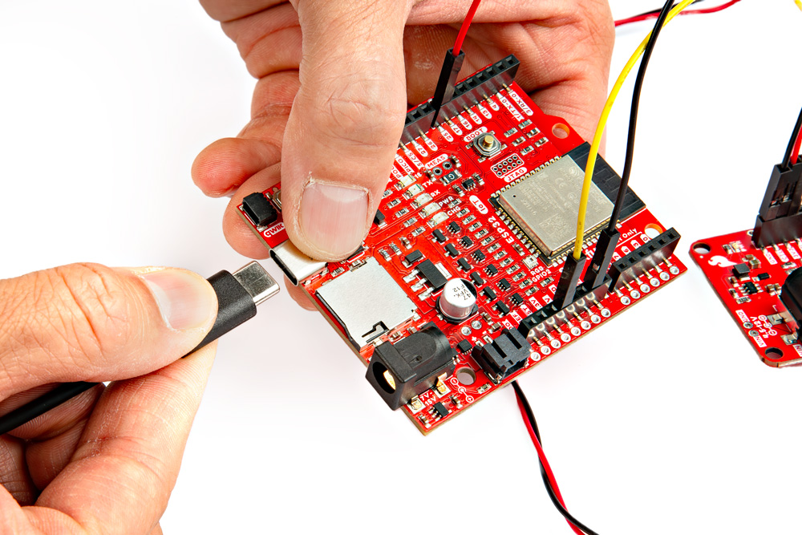
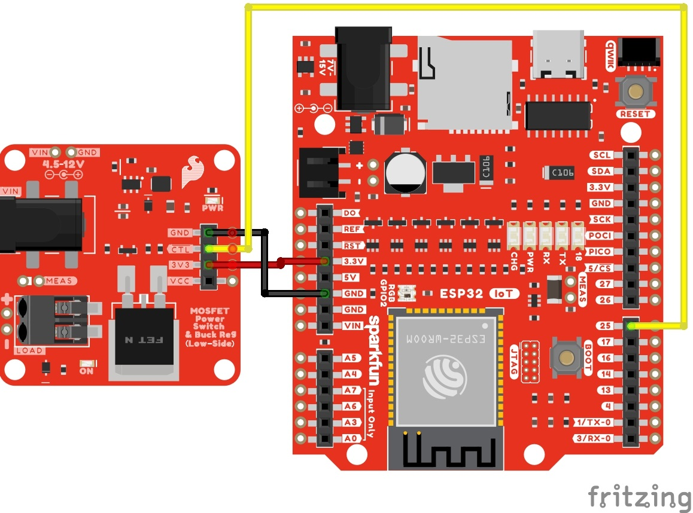
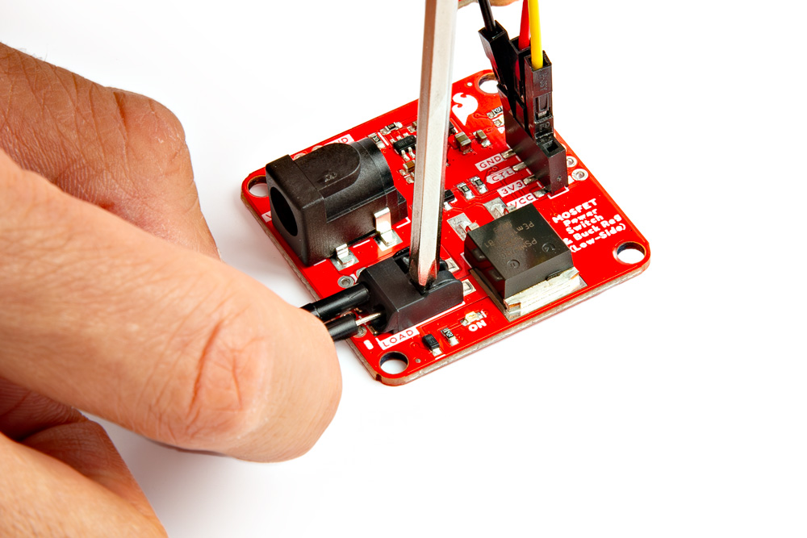
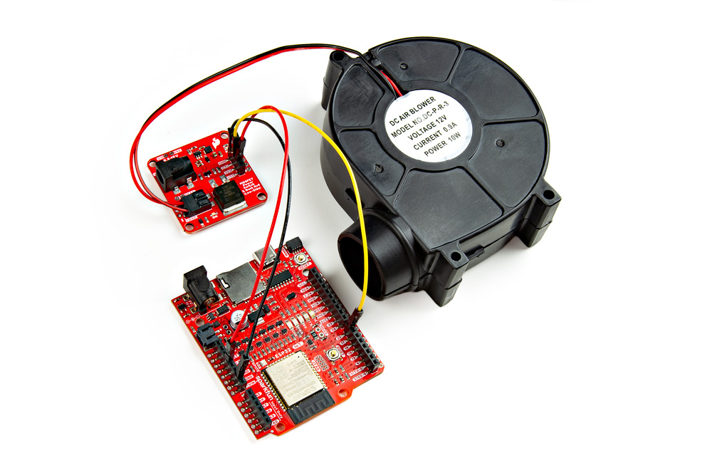
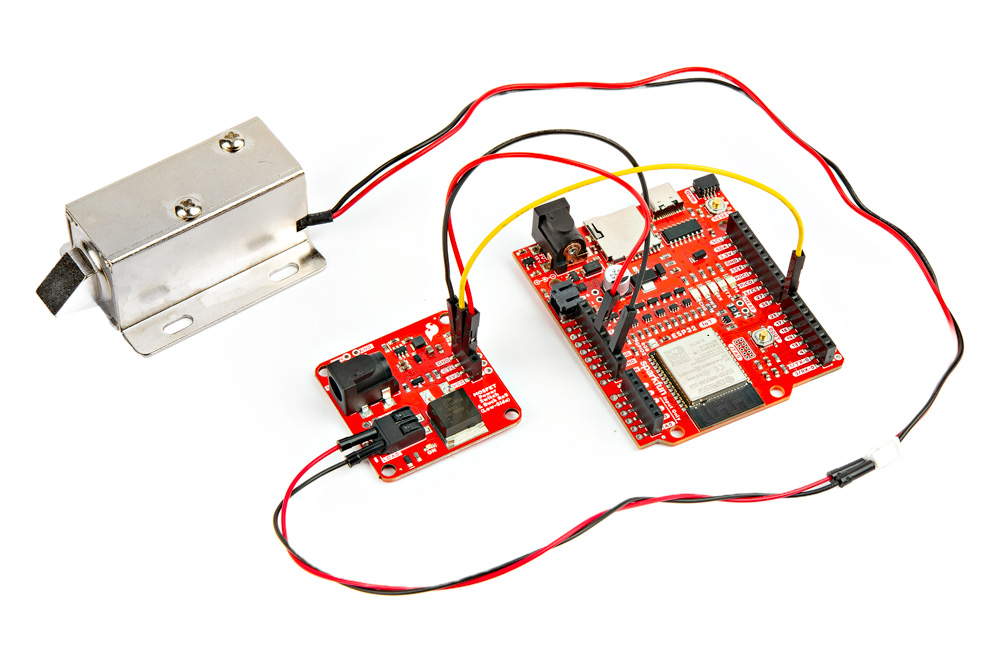
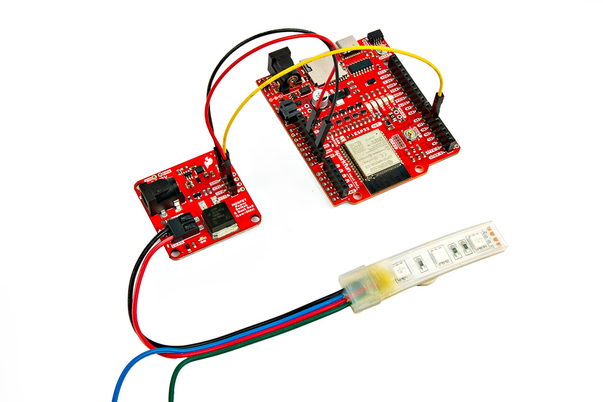
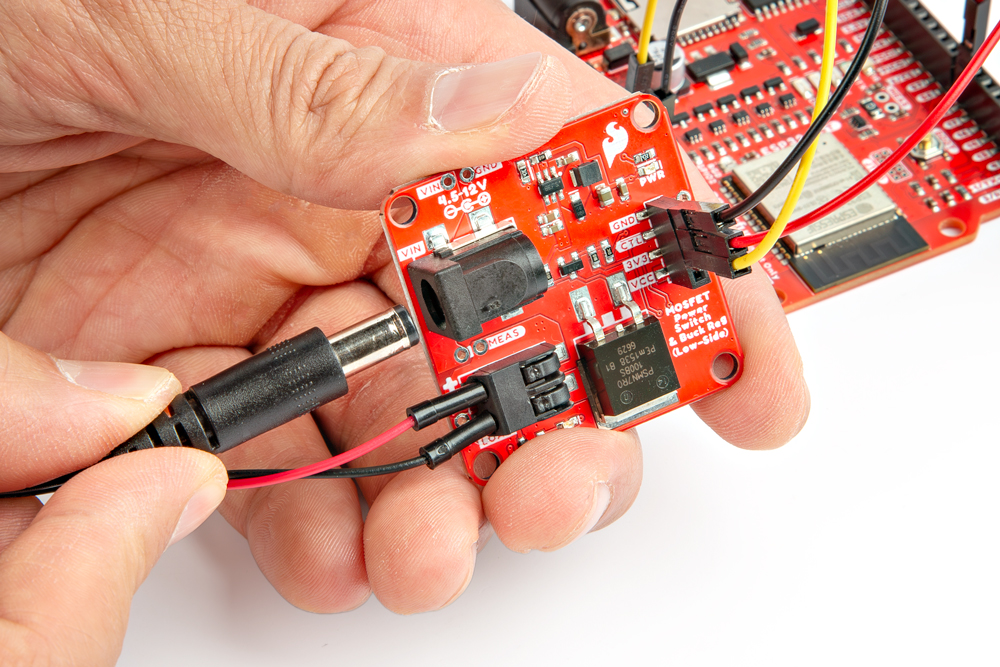

In this section, we'll go over how to connect the MOSFET Power Switch to your system.

## Upload Code to the Microcontroller

When uploading code to the IoT RedBoard - ESP32, we will connect a USB C cable. When powering the load, we will want to disconnect the USB cable to avoid conflicting voltages.

  <table>
    <tr style="vertical-align:middle;">
     <td style="text-align: center; vertical-align: middle;"></td>
  </table>

!!! tip
     If necessary, you can disconnect the 3.3V jumper wire connecting the MOSFET Power Switch and Buck Regulator to the IoT RedBoard - ESP32. That way you can power the load with the barrel jack while also debugging code when the USB cable is connected to the IoT RedBoard - ESP32.

### Control

!!! note
    The tutorial focuses on using a microcontroller with Arduino. However, if your microcontroller has a digital or PWM, you can also control the N-channel MOSFET controller as well! You can also use this using a micro:bit with MakeCode or Raspberry Pi's RP2040 microcontroller with MicroPython!

For prototyping or connecting to the control side, we recommend using a 3.3V development board with header pins already soldered to the board. In this case, we used the IoT RedBoard - ESP32. Depending on how you are controlling the load, you may need a digital or PWM pin. Don't forget to connect power and ground. In this case, we will use 3.3V from the output of the buck regulator. Of course, you could also connect the microcontroller or additional devices to the VCC pin as an alternative. Just make sure to choose one when powering your microcontroller or any additional peripheral device.

    <table>
        <tr>
            <th style="text-align: center; border: solid 1px #cccccc;">MOSFET Power Switch
            </th>
            <th style="text-align: center; border: solid 1px #cccccc;">IoT RedBoard - ESP32
            </th>
        </tr>
        <tr>
            <td style="text-align: center; border: solid 1px #cccccc;" bgcolor="#f2dede">3V3
            </td>
            <td style="text-align: center; border: solid 1px #cccccc;" bgcolor="#f2dede">3.3V
            </td>
        </tr>
        <tr>
            <td style="text-align: center; border: solid 1px #cccccc;" bgcolor="#DDDDDD">GND
            </td>
            <td style="text-align: center; border: solid 1px #cccccc;" bgcolor="#DDDDDD">GND
            </td>
        </tr>
        <tr>
            <td style="text-align: center; border: solid 1px #cccccc;" bgcolor="#cce5ff">CTL
            </td>
            <td style="text-align: center; border: solid 1px #cccccc;" bgcolor="#cce5ff">D25
            </td>
        </tr>
    </table>

Below is a circuit diagram with the MOSFET Power Switch and Buck Regulator Break connecting to the IoT RedBoard - ESP32. Most of the examples will follow this pin connection to control the load. However, there are a few examples that will include additional circuits and a different pin for the control.

  <table>
    <tr style="vertical-align:middle;">
     <td style="text-align: center; vertical-align: middle;"></td>
    </tr>
  </table>

!!! warning
    When powering and programming your Arduino, make sure to disconnect power between the MOSFET Power Switch and Arduino to avoid conflicting voltages. Of course you could use a [Schottky diode for protection](https://learn.sparkfun.com/tutorials/diodes#diode-applications). The caveat is that you will just have a slight voltage drop.

### Load

Connect a high voltage device of your choice (e.g. DC motor, solenoid, 12V LED) to the load side (VCC to &plus; and GND to &minus;). You will need a ball point pen to push down on each poke-home connector's tab. A [mini screwdriver](https://www.sparkfun.com/products/9146) (Phillips or flat head) will also work as well.  As you are pressing down on the tab, insert a [stripped wire](https://learn.sparkfun.com/tutorials/working-with-wire/how-to-strip-a-wire) or jumper wire pin into the socket. Repeat for the other connection.

  <table>
    <tr style="vertical-align:middle;">
     <td style="text-align: center; vertical-align: middle;"></td>
    </tr>
  </table>

Below are a few examples. The squirrel cage blower we just inserted the Poke-Home conenctor since the wires were stripped. For the latching solenoid, we used M/M jumper wires between the 2-pin connector and the Poke-Home connector. We used part of a 12V LED strip rather than a full strip.

  <table>
    <tr style="vertical-align:middle;">
     <td style="text-align: center; vertical-align: middle;"></td>
     <td style="text-align: center; vertical-align: middle;"></td>
     <td style="text-align: center; vertical-align: middle;"></td>
    </tr>
  </table>

!!! tip
    Worried about the M/M jumper wire's pins when inserting the Poke-Home connector? There are other [M/M jumper wires available](https://www.sparkfun.com/products/11026). These are lower cost and  so you do not have to worry about damaging your premium jumper wires. These were used with the latching solenoid's 2-pin connector.

### Input Voltage

Grab a compatible wall adapter that is within the recommended voltage range for your project. Make sure that the barrel jack's output is a center-positive. Then insert it into the barrel jack connector.

  <table>
    <tr style="vertical-align:middle;">
     <td style="text-align: center; vertical-align: middle;"></td>
    </tr>
  </table>

### Connecting to the PTHs

For users that prefer to use the PTHs, we recommending soldering to the connection. You can choose between a combination of [header pins and jumper wires](https://learn.sparkfun.com/tutorials/how-to-solder-through-hole-soldering/all), or [stripping wire and soldering the wire](https://learn.sparkfun.com/tutorials/working-with-wire/all) directly to the board.

-   <a href="https://learn.sparkfun.com/tutorials/how-to-solder-through-hole-soldering/all">
      <figure markdown>
        
      </figure>
    </a>

    ---

    <a href="https://learn.sparkfun.com/tutorials/how-to-solder-through-hole-soldering/all">
      <b>How to Solder: Through Hole Soldering</b>
    </a>
<!-- ----------WHITE SPACE BETWEEN GRID CARDS---------- -->
-   <a href="https://learn.sparkfun.com/tutorials/working-with-wire/all">
      <figure markdown>
        
      </figure>
    </a>

    ---

    <a href="https://learn.sparkfun.com/tutorials/working-with-wire/all">
      <b>Working with Wire</b>
    </a>
<!-- ----------WHITE SPACE BETWEEN GRID CARDS---------- -->

!!! tip
    The PTHs are connected to large polygon pours and traces. You may need a larger soldering iron tip, increase the soldering station's temperature, some flux, or leave the soldering tip a little longer in order for the solder to flow better.
