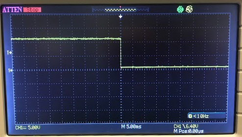
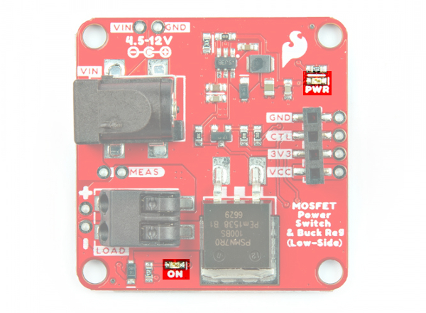
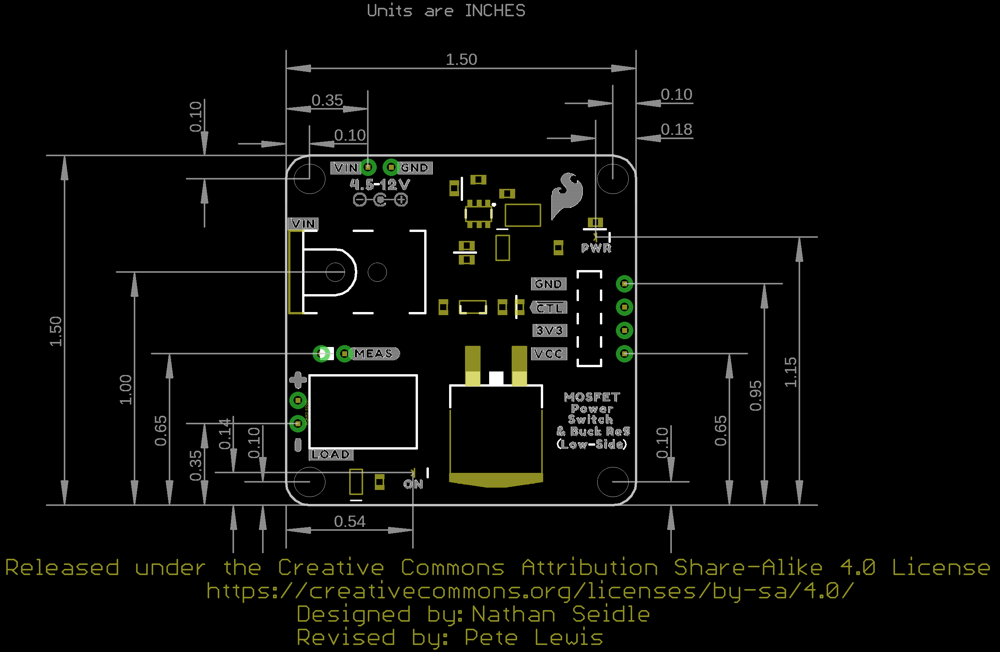

In this section, we will highlight the features of the N-channel MOSFET Power Switch and Buck Regulator (Low-Side). For more information about the LMR14203 3.3V buck regulator or PSMN7R0-100BS N-channel MOSFET, make sure to check out the datasheets that are linked in the [Resources section](../resources).

  <table>
    <tr style="vertical-align:middle;">
     <td style="text-align: center; vertical-align: middle;"></td>
     <td style="text-align: center; vertical-align: middle;"></td>
    </tr>
    <tr style="vertical-align:middle;">
     <td style="text-align: center; vertical-align: middle;"><i>Top View</i>
     </td>
     <td style="text-align: center; vertical-align: middle;"><i>Bottom View</i>
     </td>
    </tr>
  </table>

### N-Channel MOSFET

The N-channel MOSFET is configured as a low-side switch. On the back of the board, there is a ground plane to aid in heat dissipation. At 12V, 3A the board stays cool (40 &degC;) under a continuous load. At 12V, 8.5A with shorter bursts of current (i.e. 5-10 seconds per burst, max current), the board gets toasty (80&degC;). You will want to avoid touching the board since it will burn your finger.

  <table>
    <tr style="vertical-align:middle;">
     <td style="text-align: center; vertical-align: middle;"></td>
     <td style="text-align: center; vertical-align: middle;"></td>
    </tr>
    <tr style="vertical-align:middle;">
     <td style="text-align: center; vertical-align: middle;"><i>N-Channel MOSFET</i>
     </td>
     <td style="text-align: center; vertical-align: middle;"><i>Ground Plane Under MOSFET for Heat Dissipation</i>
     </td>
    </tr>
  </table>

### Input Voltage

There are two options to connect to the input voltage:

* **Barrel Jack** &mdash; For users with a wall adapter, you could use a 5.5mm x 2.1mm center positive, barrel jack with the recommended input voltage. This is for users that want to easily connect the power supply without the need to solder. Make sure to check the specifications of your wall adapter before connecting since some power supplies have a different polarity.
* **PTHs** &mdash; There is also a pair of pads beside the barrel jack to connect to the input voltage (**VIN**) and ground (**GND**). The PTHs are for users that want a more permanent connection and require a smaller profile by soldering wires directly to the PTH. We recommend connecting power from your power supply to this VIN PTH rather than the one by the 1x4 header. The polygon pours connected to the PTH are thicker and can handle the power as opposed to the VCC pin by the 1x4 header.

These connections are broken out as follows:

* **VIN** &mdash; The recommended input voltage is between **4.5V** and **12V**.
* **GND** &mdash; Common ground or 0V.

  <table>
    <tr style="vertical-align:middle;">
     <td style="text-align: center; vertical-align: middle;"></td>
    </tr>
    <tr style="vertical-align:middle;">
     <td style="text-align: center; vertical-align: middle;"><i>Input Voltage Options Highlighted
         </i>
     </td>
    </tr>
  </table>

### 3.3V Regulator Output Voltage

Voltage from the input is brought down to 3.3V/300mA with the buck regulator. This is intended to connect to a microcontroller's 3.3V pin using either the 1x4 header and the PTHs.

  <table>
    <tr style="vertical-align:middle;">
     <td style="text-align: center; vertical-align: middle;"></td>
    </tr>
    <tr style="vertical-align:middle;">
     <td style="text-align: center; vertical-align: middle;"><i>Output Voltage Highlighted
         </i>
     </td>
    </tr>
  </table>

### 1x4 Header Connections

On the side of the board, there are two options to connect to ground, control pin, output 3.3V voltage, and input voltage,

* **1x4 female header** &mdash; Users that have jumper wires with male pins can easily connect to the female headers.
* **PTHs** &mdash; For users that require a more secure connection like the input voltage side, you can also solder to the PTHs as well. As explained earlier, the traces connecting to the VCC on this side is not as big as the one by VIN by the barrel jack.

These connections are broken out as follows:

* **GND** &mdash; Common ground or 0V.
* **CTL** &mdash; Short for control, this pin is connected to the N-channel MOSFET's gate pin and it is active low. There is a [pull-up resistor](https://learn.sparkfun.com/tutorials/pull-up-resistors/all) connected to this pin. Users can connect to a jumper wire from this pin to GND to turn on the MOSFET and provide power to the load. Of course, this board was designed to connect to a microcontroller so it can be connected to a digital or PWM pin. Toggling the control pin with the digital pin will turn on and off MOSFET. Using a PWM pin will give you more flexibility to turn on, off, or partially on the load.  
* **3V3** &mdash; 3.3V output from the buck regulator. This is intended to connect to a microcontroller's 3.3V pin.
* **VCC** &mdash; This pin is connected to the MEAS jumper and VIN. The trace connecting to the pin on the control side is smaller than the polygon pour for VIN. Users can also connect the microcontroller's input voltage to this pin as an alternative to using the 3V3 if their system requires. Just make sure to choose either the 3V3 or VCC to power the microcontroller. Of course, users can also power additional devices on this pin as well.

  <table>
    <tr style="vertical-align:middle;">
     <td style="text-align: center; vertical-align: middle;"></td>
    </tr>
    <tr style="vertical-align:middle;">
     <td style="text-align: center; vertical-align: middle;"><i>1x4 Header Highlighted
         </i>
     </td>
    </tr>
  </table>

### Load Side

There are two options to connect to the output load side.

* **Poke-Home Connectors** &mdash; For users that have a stripped wire or jumper wire pins, you can use a ballpoint pen to press down on the tab of the connector to insert a stripped wire or pin into the connector. You can also use a mini screwdriver (Phillips or flat head)
* **PTHs** &mdash; For users that want a permanent connection, you can solder your load directly to the PTHs.

The N-channel MOSFET is configured as a low-side switch: the load is connected to the N-channel MOSFET's drain pin, while the source is connected to ground

The load side connections are broken out as follows:

* **VCC** (or &plus;) &mdash; This pin is for connecting the load's input voltage to the VCC pin.
* **LOAD** (or &minus;) &mdash; This pin is intended for connecting the load's ground to the LOAD pin.

  <table>
    <tr style="vertical-align:middle;">
     <td style="text-align: center; vertical-align: middle;"></td>
    </tr>
    <tr style="vertical-align:middle;">
     <td style="text-align: center; vertical-align: middle;"><i>Load Side Highlighted
         </i>
     </td>
    </tr>
  </table>

!!! note
    There is also a flyback diode connected to the load side! This component is for loads with motors. When the motor is spinning and suddenly turned off, the magnetic field inside it collapses, generating a voltage spike. This can damage the transistor. These voltage spikes can also happen with solenoids. The image below (taken from [Pete](https://github.com/lewispg228)'s camera!) shows an [oscilloscope](https://learn.sparkfun.com/tutorials/how-to-use-an-oscilloscope/all) measuring the nasty voltage spike as soon as the 12V latching solenoid (without a flyback diode) is turned off.

    

      <table>
        <tr style="vertical-align:middle;">
         <td style="text-align: center; vertical-align: middle;"></td>
        </tr>
        <tr style="vertical-align:middle;">
         <td style="text-align: center; vertical-align: middle;"><i>Voltage without Flyback Diode
             </i>
         </td>
        </tr>
      </table>
    

    To prevent voltage spikes, we use a "[flyback diode](https://learn.sparkfun.com/tutorials/diodes#diode-applications)," which suppresses the voltage spike. As seen below the voltage is not as dangerous for our N-channel MOSFET.

    

      <table>
        <tr style="vertical-align:middle;">
         <td style="text-align: center; vertical-align: middle;"></td>
        </tr>
        <tr style="vertical-align:middle;">
         <td style="text-align: center; vertical-align: middle;"><i>Voltage with Flyback Diode
             </i>
         </td>
        </tr>
      </table>
    

### LEDs

There are two LEDs on the board.

* **PWR** &mdash; The power LED lights up when there is power on the output of the 3.3V buck regulator. This LED can be disabled by cutting the trace on the **PWR_LED** jumper.
* **ON** &mdash; The ON LED lights up when the control pin is pulled low indicating that there is power applied to the load. This LED can be disabled by cutting the trace on the **ON_LED** jumper.

  <table>
    <tr style="vertical-align:middle;">
     <td style="text-align: center; vertical-align: middle;">
     </td>
    </tr>
    <tr style="vertical-align:middle;">
     <td style="text-align: center; vertical-align: middle;"><i>LEDs Highlighted
         </i>
     </td>
    </tr>
  </table>

### Jumpers

There are a few jumper pads available on the bottom of the board. For more information on modifying the jumpers, check out our [tutorial on working with jumper pads and PCB traces](https://learn.sparkfun.com/tutorials/how-to-work-with-jumper-pads-and-pcb-traces).

* **PWR_LED** &mdash; By default, this jumper is closed. This is connected to the **PWR** LED and indicates when there is power. Cut this trace to disable the power LED that is connected to 3.3V.
* **MEAS** &mdash; To enable measurements and determine how much current your system is pulling, we've added a NC (normally closed) jumper between the two MEAS PTH pins. By cutting this jumper, the voltage connecting to the 3.3V voltage regulator's input is interrupted. Soldering in male jumper pins or wires into the accompanying holes will give you the ability to insert a current meter and precisely monitor how much current your application is consuming.
* **ON_LED** &mdash; By default, this jumper is closed. This is connected to the **ON** LED. This LED indicates when the control pin is pulled low and when there is power applied to the load. Cut this trace to disable the **ON** LED that is connected to the control pin.

  <table>
    <tr style="vertical-align:middle;">
     <td style="text-align: center; vertical-align: middle;"></td>
    </tr>
    <tr style="vertical-align:middle;">
     <td style="text-align: center; vertical-align: middle;"><i>Jumpers Highlighted
         </i>
     </td>
    </tr>
  </table>

### Board Dimensions

The board is 1.50" x 1.50" (38.1mm x 38.1mm), which is slightly bigger than a typical 1.0"x1.0" Qwiic sized board. There are 4x mounting holes by each corner of the board.

  <table>
    <tr style="vertical-align:middle;">
     <td style="text-align: center; vertical-align: middle;"></td>
    </tr>
    <tr style="vertical-align:middle;">
     <td style="text-align: center; vertical-align: middle;"><i>Board Dimensions
         </i>
     </td>
    </tr>
  </table>

